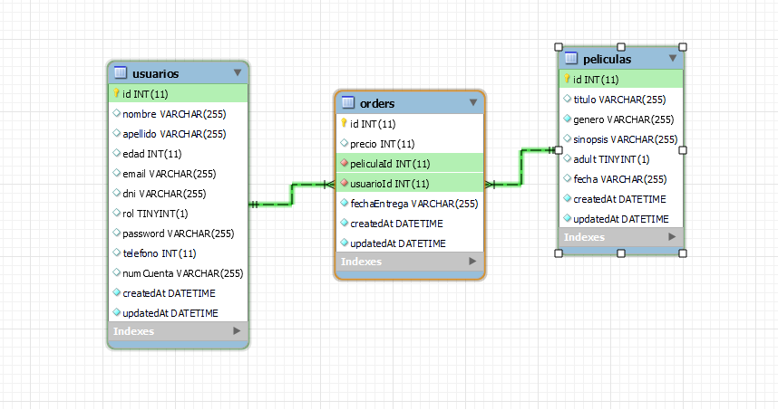
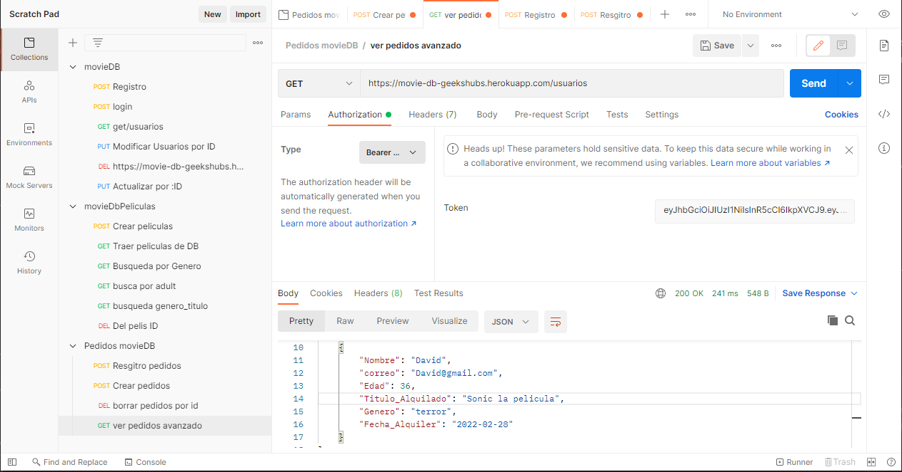
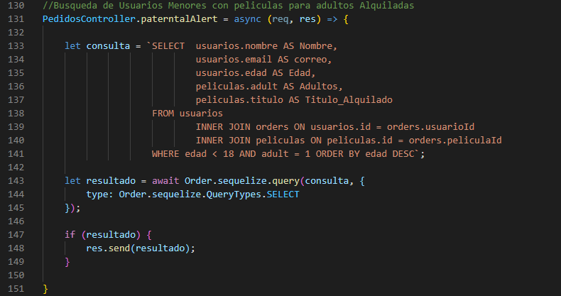

# Movies DB Backend


[English version](#English-version)<br>

## 0. Indice:


  [1. Introduccion:](#1-introducción)<br>
  [2. Descripción del proyecto.](#2-como-usar)<br>
  [3. Como Usar:](#3-descripción-del-proyecto)<br>
  [4. Futuras Funcionalidades:](#4-Futuras-Funcionalidades)<br>
  [5. Herramientas Utilizadas:](#5herramientas-utilizadas)<br>


## 1. Introducción.

- Proyecto desarrollado para GeeksHubs Academy, en este simulamos un "e-commerce" que se dedica al alquiler de películas, la cual dispondra de una API RestFul para el manejo del CRUD en los Endpoints detallados mas abajo y una Base de Datos propia para el almacenamiento de pedidos, a la vez que listados de películas y usuarios (los cuales podrán registrarse y realizar login). <br>
  
- BackEnd and BBDD Deployed on [HEROKU](https://movie-db-geekshubs.herokuapp.com)<br>
- Aquí una imagen del diseño de la Base de datos :
  



## 2. Descripción del proyecto.

- En este proyecto se ha creado un BackEnd completo y funcional para la simulación de un "e-commerce", que continuación se describirán las partes que compone este BackEnd :
  

- API Restful para el manejo del CRUD de los EndPoints (descritos mas abajo), consta de 3 diferentes "views" que en las que podemos encontrar Pedidos, Películas y Usuarios, al estar modularizado de esta manera conseguimos una mejor limpieza en el código y una mayor escalabilidad.
  
- BBDD Relacional en MySql, la cual nos permite una gestión muy potente y robusta frente a las no Relacionales como MongoDB y también gracias a MySql las consultas en PEDIDOS estan en RAW SQL implementado para practicar su uso en el proceso de aprendizaje con este proyecto.
  

## 3. Como Usar.

- Este proyecto esta deployado en HEROKU por lo cual para probarlo solo tendras que tener una herramienta llamada POSTMAN la cual te permite probar el CRUD en los endpoints.
  <br>

- Una vez abierto el postman simplemente tienes que introducir esta URL :<br>
    https://movie-db-geekshubs.herokuapp.com/ 

- Tendrás que registrarte por POSTMAN y hacer Login para obtener el JWT, que te autorizara a ejecutar el resto de EndPoints.

- Introduce el token aqui:



<br>
    
A continuacion se describen las posibilidades que tienes:

### EndPoints de /usuarios :

Ejemplo: https://movie-db-geekshubs.herokuapp.com/usuarios

- Registro :
  
  ```bash
  router.post('/', UsuarioController.registraUsuario);
  ```

- Login : 
  
  ```bash
  router.post('/login', UsuarioController.logUsuario);
  ```

- Leer todos los usuarios :
  
  ```bash
  router.get('/', auth, UsuarioController.traeUsuarios);
  ```

- Borra todos los usuarios de la base de datos :
  
  ```bash
  router.delete('/', auth, isAdmin, UsuarioController.deleteAll);
  ```

- Actualizar pass usuario :
  
  ```bash
  router.put('/newpassword', auth, UsuarioController.updatePassword);
  ```

- Busca en la db usuarios por ID :
  
  ```bash
  router.get('/:id', auth, UsuarioController.traerUsuarioId);
  ```

- Borra de la db usuarios por ID :
  
  ```bash
  router.delete('/:id', auth, isAdmin, UsuarioController.deleteById);
  ```

- Actualiza datos de usuarios en la DB :
  
  ```bash
  router.put('/:id', auth, UsuarioController.updateProfile);
  ```

- Busca usuarios en la db por email :
  
  ```bash
  router.get('/email/:email', auth, UsuarioController.traerUsuarioEmail);
  ```

<br>


### EndPoints de /peliculas :

Ejemplo: https://movie-db-geekshubs.herokuapp.com/peliculas

- Leer todos las Peliculas de nuestra propia DB :
  
  ```bash
  router.get('/', auth, PeliculasController.traePeliculas);
  ```
  
- Registro Peliculas En la propia DB :

  ```bash
  router.post('/', auth, PeliculasController.registraPelicula);
  ```

- Borrar Pelicula DB propia :
    ```bash
    router.delete('/', auth, isAdmin, PeliculasController.borrarPelicula);
    ```
- Busca peliculas por Genero En propia DB :
    ```bash
    router.get('/genero', auth, PeliculasController.buscaGenero);
    ```
- Busca peliculas por Adult En propia DB :
  
    ```bash
    router.get('/adult', auth, PeliculasController.buscaAdult);
    ```

- Buscar Peliculas por Genero y Titulo en propia DB : 

    ```bash
    router.get('/genero_titulo', auth, PeliculasController.buscaGenTit);
    ```

EndPoints Varios a la API de MovieDB :

- Busqueda de peliculas por titulo : 

    ```bash
    router.get('/titulo', auth, PeliculasController.peliculasTitulo)
    ```

- Busqueda de novedades : 

    ```bash
    router.get('/novedades', auth, PeliculasController.traeNovedades)
    ```

- Ultima pelicula subida a la base de datos : 

    ```bash
    router.get('/ultimas', auth, PeliculasController.peliculasUltimas)
    ```

- Traemos las peliculas con mejor nota : 

    ```bash
    router.get('/top_rated', auth, PeliculasController.peliculasValoradas)
    ```

- Traemos las peliculas relacionadas con la pelicula ID :

    ```bash
    router.get('/:id/relacionadas', auth, PeliculasController.peliculasRelacionadas)
    ```

- Busqueda por ID :

    ```bash
    router.get('/:id', auth, PeliculasController.peliculasPorId)
    ```

- Busqueda de Reviews de peliculas por id :

    ```bash
    router.get('/:id/reviews', auth, PeliculasController.peliculasIdReviews)
    ```


### EndPoints de /pedidos :

Ejemplo: https://movie-db-geekshubs.herokuapp.com/pedidos

- Buscamos Pedidos Todos los pedidos en DB :
  
  ```bash
  router.post('/', auth, PedidosController.nuevoPedido);
  ```

- Buscamos Pedidos Todos los pedidos en DB :

    ```bash
    router.get('/', auth, PedidosController.todosPedidos);
    ```

- Borramos todos los pedidos en DB :

    ```bash
    router.get('/', auth, PedidosController.todosPedidos);
    ```

- Busqueda Avanzada de pedido en DB :

    ```bash
    router.get('/avanzado', auth, PedidosController.infoPedidoAvanzado);
    ```

- Borrar pedidos de Ususarios por Nombre :

    ```bash
    router.delete('/avanzado/usuarios/:nombre', auth, PedidosController.borrarNombre)
    ```

- Busqueda Avanzada de Usuarios por Nombre :

    ```bash
    router.get('/avanzado/usuarios/:nombre', auth, PedidosController.pedidoNombre);
    ```

- Busqueda avanzada de Usuarios con alquiler :

    ```bash
    router.get('/avanzado/usuarios', auth, PedidosController.infoUsuarios);
    ```

- Busqueda de Usuarios Menores con peliculas para adultos Alquiladas :

    ```bash
    router.get('/paterntalAlert', auth, PedidosController.paterntalAlert);
    ```

- Borrar pedidos por ID en DB :

    ```bash
    router.delete('/:id', auth, PedidosController.borrarPorId);
    ```

Todos los EndPoint de /pedidos esta realizado con consultas RAW SQL:<br>



## 4. Futuras funcionalidades.

- Mas adelante me gastaría pulir los Campos de las tablas añadiendo o modificando algunos para aumentar la cantidad de Endpoints, añadiendo mas vistas y mas funcionalidades.
- Como extra me gastaría también poder añadir un FrontEnd con React.


## 5. Herramientas Utilizadas.

- MySQL Workbench - (BBDD)
- Visual Studio Code - (DEV)
- Postman - (DEBUG)
- Heroku - (DEPLOY)

<br>

## English version


### (404)
WORK IN PROGRESS...<br>

[Subir](#top)
